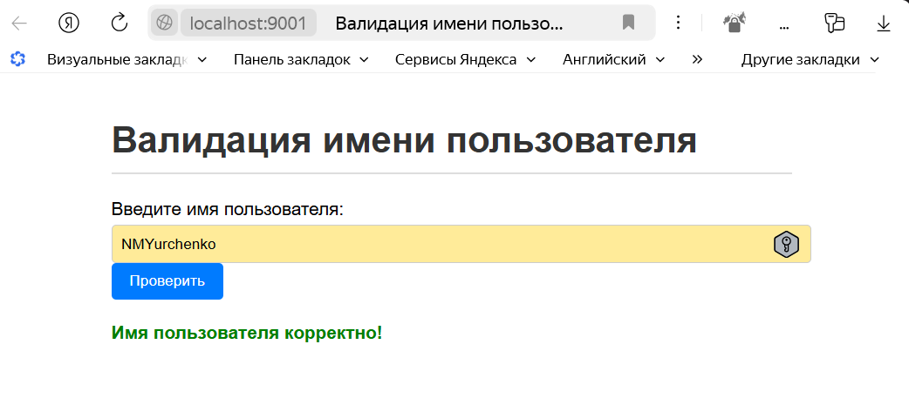

# Домашнее задание к лекции «Регулярные выражения»

[](https://ci.appveyor.com/project/NMYurchenko-max/ajs-hw-7-regex)

## Описание

[Задание смотри здесь](https://github.com/netology-code/ajs-homeworks/tree/ajs8/regex)

## Структура проекта

```plantext

ajs-hw7-regex/

|---.husky/
|--- coverage/
|--- dist/
|    |--- index.html
|    |--- index.js
|    |--- style.css
|--- src/
|    |--- index.html
|    |--- index.js
|    |--- css/
|    |    |--- style.css
|    |--- js/
|        |--- app.j
|        |---classes/
|        |    |--- Validator.js
|        |---test/
|            |--- Validator.test.js
|── .gitkeep
|── .gitignore
|── .eslint.config.mjs
|── .babelrc
|── .browserslistrc
|── .editorconfig
|── appveyor.yml
|── package.json
|── Readme.md
|__webpack.config.js
```

## Особенности решения

### Класс `Validator.js`

* Конструктор `constructor(userName)` принимает (this.*) имя пользователя и
правила его валидации в виде регулярных выражений - ограничений для длины,
формата и использования символов в имени согдасно заданию.

* Метод `validateUsername()` возвращает набор `this.*.test(UserName)` с результатами
применения правил к введенному пользоватеьли имени.

### Тесты

Набор тестов `Validator.test.js` написан с использованием библиотеки `jest`,
описывают случаи правильного и неправидльного имени пользователя по выставленным в конструкторе класса правилам.

Для запуска тестов необходимо выполнить команду: `npm test`.
Рапорт о покрытии тестами выводится в консоль.

Запуск линтера:
Для запуска линтера необходимо выполнить команду: `npm run lint`

### Сборка приложения

#### **Главный файл приложения**  `app.js`

Мы импортируем класс Validator из "./class/Validator".
Создаем экземпляр Validator сразу после импорта.
Добавляем обработчик события для формы ввода имени пользователя, которую создали в `index.html`.

При отправке формы:
Предотвращаем стандартное поведение формы (отправку на сервер).
Получаем значение введенного имени пользователя.
Используем метод validateUsername для проверки имени пользователя.
Выводим результат валидации в элемент с id result.
Обновляем стиль элемента result в зависимости от результата валидации.

#### **Сборка и визуализация проекта на webpack**

Для запуска проекта в браузере используйте команду `npm start`.

Для запуска билда проекта используйте команду `npm run build`.

Приложение реализует валидацию имени пользователя на стороне клиента.
После загрузки страницы пользователь видит форму для ввода имени. При отправке формы:

Считывается введённое имя пользователя и удаляются лишние пробелы по краям.
Для каждого введённого имени создаётся новый экземпляр класса Validator,
который проверяет корректность имени по следующим правилам:
Имя должно содержать только латинские буквы, цифры, дефис или подчеркивание, длина — от 3 до 30 символов.
Имя не должно начинаться или заканчиваться на цифру, дефис или подчеркивание.
В имени не допускается более трёх цифр подряд.
Если имя прошло все проверки, пользователю отображается сообщение «Имя пользователя корректно!» зелёным цветом.
Если имя не соответствует правилам, выводится сообщение об ошибке красным цветом:
 «Имя пользователя некорректно. Попробуйте еще раз.»
Сообщение о результате проверки становится видимым после каждой отправки формы.
Таким образом, приложение обеспечивает мгновенную обратную связь пользователю о корректности
введённого имени без необходимости обращения к серверу.

Визуализация результата проверки имени пользователя обеспечивает простую и понятную обратную связь для пользователя,
что улучшает пользовательский опыт и удобство использования формы.



## Автоматизация

Для автоматизации сборки проекта и запуска тестов используется webpack и husky:

* webpack используется для сборки проекта в один файл.
* husky используется для автоматизации запуска тестов и сборки проекта при каждом коммите в git:
  три команды (lint, test, build) объедены для обязательного выполнения перед каждым коммитом в git с использованием husky.

## Использование проекта

Для использования проекта необходимо склонировать репозиторий:

```bash

git clone https://github.com/NMYurchenko-max/ajs-hw-7-regex.git
```

После чего установить зависимости  и запустить проект:

```bash

npm install
 npm run build
  npm start
```
